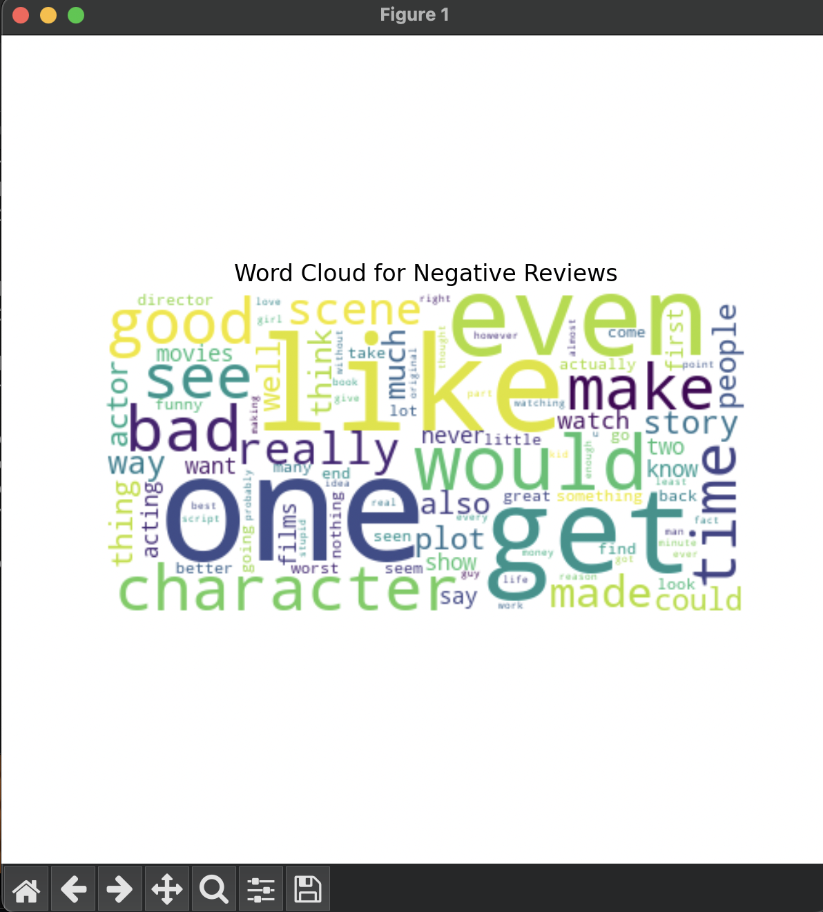

# collection of data science projects

## I: titanic data EDA analysis 

Visualize Data

## II: Sentiment Analysis on Movie Reviews 
This project uses a Naive Bayes classifier on a shortened IMDb dataset (100 rows) to classify reviews as positive or negative. It loads data from part2/data/movie-data1.csv, preprocesses text using CountVectorizer, trains the model, and visualizes results with sentiment charts, word clouds, and a confusion matrix.

Visualize Data 

Citation: Stanford AI Large Movie Review Dataset https://ai.stanford.edu/~amaas/data/sentiment/ 

@InProceedings{maas-EtAl:2011:ACL-HLT2011,
author = {Maas, Andrew L. and Daly, Raymond E. and Pham, Peter T. and Huang, Dan and Ng, Andrew Y. and Potts, Christopher},
title = {Learning Word Vectors for Sentiment Analysis},
booktitle = {Proceedings of the 49th Annual Meeting of the Association for Computational Linguistics: Human Language Technologies},
month = {June},
year = {2011},
address = {Portland, Oregon, USA},
publisher = {Association for Computational Linguistics},
pages = {142--150},
url = {http://www.aclweb.org/anthology/P11-1015}
}

## III: Predicting House Prices with Machine Learning
This project uses a Random Forest Regressor to predict house prices using the Ames Housing dataset (via Kaggle https://www.kaggle.com/datasets/shashanknecrothapa/ames-housing-dataset?select=AmesHousing.csv). The data is preprocessed by filling missing values, encoding categorical features, and visualizing key insights. A regression model is trained, evaluated using RMSE and R² scores, and feature importances are visualized.

Visualize Data

## IV: Customer Segmentation with K-Means Clustering

This project uses K-Means clustering to segment customers based on Age, Annual Income, and Spending Score. After performing exploratory data analysis (EDA), we preprocess the data with scaling and apply K-Means to discover underlying customer groups. The elbow method is used to determine the optimal number of clusters. PCA is then applied to reduce the data to two dimensions for visualizing the clusters effectively. This kind of segmentation can help businesses better understand their audience and tailor marketing strategies accordingly.

Visualize Data

**Gender Distribution**  

**Spending Score vs. Annual Income**  

**Elbow Method to Find Optimal Clusters**  

**Customer Segments Visualized with PCA**  

**Spending Score by Cluster**  

## V: Bike Sharing Demand Forecasting with Meta Prophet

This project focuses on forecasting daily bike rental demand using the Bike Sharing Dataset (day.csv). Using the Meta Prophet library (https://facebook.github.io/prophet/)  to model both seasonality and trend. After exploring the time series visually, we split the data into training and test sets, fit the model, generate forecasts, and evaluate performance using MAE and RMSE. The model also allows for interpretability through trend and seasonal components, which helps understand how factors like seasonality affect ridership.

This type of forecasting can help cities and businesses manage fleet distribution, anticipate high-demand periods, and optimize resource planning.

Visualize Data

## VI: PCA & Risk‑Parity Visualizations

This code produces four key charts:

**1. PC1 & PC2 Loadings Heatmap**  
  
Shows which stocks contribute most heavily to the first two principal components.

**2. Explained Variance (Scree Plot)**  
  
Displays how much of the total return variance each of the five PCA components captures.

**3. Rolling PCA Variance**  
  
Tracks the fraction of variance explained by PC1 and PC2 over time using a 60‑day sliding window.

**4. Stock Clustering Dendrogram**  
  
Maps how the twelve stocks group together hierarchically based on their return correlations.

## VII: Name Popularity Streamgraph

