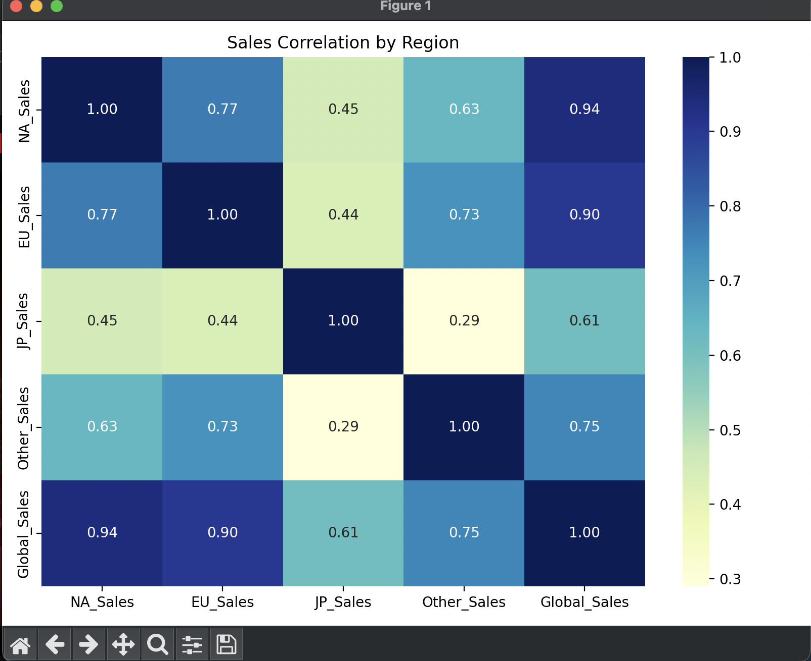

# collection of data science projects

## I: titanic data EDA analysis 

Visualize Data

## II: Sentiment Analysis on Movie Reviews 
This project uses a Naive Bayes classifier on a shortened IMDb dataset (100 rows) to classify reviews as positive or negative. It loads data from part2/data/movie-data1.csv, preprocesses text using CountVectorizer, trains the model, and visualizes results with sentiment charts, word clouds, and a confusion matrix.

Visualize Data 

Citation: Stanford AI Large Movie Review Dataset https://ai.stanford.edu/~amaas/data/sentiment/ 

@InProceedings{maas-EtAl:2011:ACL-HLT2011,
author = {Maas, Andrew L. and Daly, Raymond E. and Pham, Peter T. and Huang, Dan and Ng, Andrew Y. and Potts, Christopher},
title = {Learning Word Vectors for Sentiment Analysis},
booktitle = {Proceedings of the 49th Annual Meeting of the Association for Computational Linguistics: Human Language Technologies},
month = {June},
year = {2011},
address = {Portland, Oregon, USA},
publisher = {Association for Computational Linguistics},
pages = {142--150},
url = {http://www.aclweb.org/anthology/P11-1015}
}

## III: Predicting House Prices with Machine Learning
This project uses a Random Forest Regressor to predict house prices using the Ames Housing dataset. The data is preprocessed by filling missing values, encoding categorical features, and visualizing key insights. A regression model is trained, evaluated using RMSE and R² scores, and feature importances are visualized.

Visualize Data

